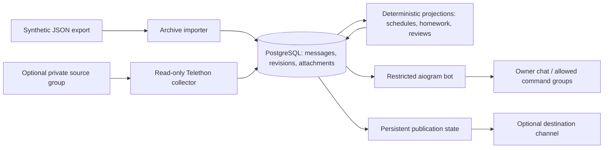

<div align="center">

# Study Chat Bot

**From chat messages to traceable schedules and homework.**

A Python backend with revision-aware storage, conservative English parsing,
and optional Telegram collection and delivery.

[](pyproject.toml)
[](compose.yaml)
[](examples/)
[](OWNER_SETUP.md)

[Quickstart](#quickstart) | [Architecture](#architecture) | [Validation](#validation) | [Security](SECURITY.md) | [Live setup](OWNER_SETUP.md)

</div>

---

> **Synthetic examples only.** Every shipped name, ID, message, date and room is invented. No original chat export, private attachment, Telegram session, credential or personal deployment history is included.

## What this project demonstrates

| Backend concern | Implementation |
| --- | --- |
| Repeatable ingestion | Telegram Desktop JSON import with stable message identities and revision history |
| Conservative parsing | Supported English text formats, source references and explicit review states |
| Missing information | Unavailable attachments and unspecified deadlines remain visible |
| Human corrections | Owner edits survive automatic reparsing |
| External delivery | Persistent publication state and reconciliation of uncertain sends |
| Access boundaries | Read-only collector, restricted bot commands and a separate publication destination |

The parser uses deterministic rules. LLM, OCR, vision and document text extraction are not implemented. The project handles one source group with one collector; broad natural-language understanding and large-scale operation are outside its current scope.

## Quickstart

**Requirements:** Docker with Compose. Run containers locally only during active work. The Compose project is `study-chat-local`, and services have automatic restarts disabled.

### 1. Configure the offline environment

Copy `.env.example` to `.env` and set a private, URL-safe `POSTGRES_PASSWORD`. Leave all Telegram credentials and IDs empty. Compose supplies the database URL inside the containers; the host URL in `.env.example` is for a separately configured host Python workflow.

```sh
cp .env.example .env
docker compose build
docker compose up -d db
docker compose run --rm migrate
```

### 2. Import and inspect the invented archive

The image contains the synthetic fixtures and command-line tools. Use the `migrate` service to run one-off commands against the Compose database:

```sh
docker compose run --rm migrate python -m app.cli import --export examples/desktop-export.json
docker compose run --rm migrate python -m app.cli import --export examples/desktop-export.json
docker compose run --rm migrate python -m app.cli summary
docker compose run --rm migrate python -m app.cli show --id 1
```

The second unchanged import should report unchanged messages without creating new revisions.

Verified synthetic import:

```text
First import    created=8  changed=0  unchanged=0
Second import   created=0  changed=0  unchanged=8
Stored          8 messages · 8 revisions · 1 unavailable document
```

### 3. Build the projections

```sh
docker compose run --rm migrate python -m app.cli schedule-sync
docker compose run --rm migrate python -m app.cli schedule --date 2030-04-06
docker compose run --rm migrate python -m app.cli schedule-reviews
docker compose run --rm migrate python -m app.cli homework-sync
docker compose run --rm migrate python -m app.cli homework
```

**Expected boundary:** the invented archive has no confirmed live schedule publisher. Schedule candidates remain in review; the date command reports no verified schedule. Explicit homework subjects can still be parsed. This demonstrates uncertainty handling without granting synthetic identities live authority.

For continuous local projection updates, start `docker compose up -d worker`. With empty Telegram settings, it does not publish or connect to Telegram.

### 4. Stop when finished

```sh
docker compose --profile live stop
docker compose ps
```

Keep the database, media and session volumes. The project is intended to run while actively in use, with no autostart service or remote deployment.

## Architecture



The stored source and the parsed result remain separate. Revisions preserve evidence; owner corrections survive reparsing, while changed source evidence can require renewed review. Estimated schedules are labeled views, rather than verified source records.

A send timeout can leave delivery unknown. Publication state records that uncertainty instead of blindly sending a duplicate.

## Validation

Run the synthetic checks from the built image:

```sh
docker compose run --rm migrate python -m pytest -q
```

Database integration checks skip unless `TEST_DATABASE_URL` points to a separate, migrated PostgreSQL database whose name ends in `_test`. Never use the application's database for those checks. The command above does not enable database integration by itself.

**Verified on 2026-10-02:** 39 tests passed with a separate local PostgreSQL database; migrations reached `0009_bot_responses`. The local worker started successfully and all project containers were stopped after verification. This is a recorded check, not a CI badge. [Security findings and remaining risks](SECURITY.md).

**Refactor verified on 2026-10-04:** 60 tests passed in the built image with a separate PostgreSQL test database. See [refactor verification](VALIDATION.md#refactor-verification---2026-10-04) for startup, compatibility and offline worker checks.

Fixtures and fake Telegram adapters check implementation behavior. They do not prove a real collector event, Telegram conversation or channel delivery. See [VALIDATION.md](VALIDATION.md) for the verification boundaries.

## Optional live setup

Live credentials are not shipped or configured. [OWNER_SETUP.md](OWNER_SETUP.md) explains private export preparation, exact-byte fingerprints, group binding, publisher evidence and session authorization.

The source group, allowed command groups and publication channel are separate settings. The collector does not post to the source group. Setting a destination channel enables external publication by the worker, so configure it deliberately.

## Explore the code

| Start here | Responsibility |
| --- | --- |
| [app/importer.py](app/importer.py) | Normalization, safe attachment paths and idempotent revision storage |
| [app/collector.py](app/collector.py) | Confirmed source binding, live events and history reconciliation |
| [app/schedule.py](app/schedule.py) | Schedule parsing, daily projections and labeled estimates |
| [app/homework.py](app/homework.py) | Homework evidence, deadlines and uncertainty |
| [app/homework_selection.py](app/homework_selection.py) | History and named lesson assignments |
| [app/study_view.py](app/study_view.py) | Shared command/channel views and source references |
| [app/telegram_sources.py](app/telegram_sources.py) | Telegram source URLs |
| [app/homework_review.py](app/homework_review.py) | Durable owner review and corrections |
| [app/bot.py](app/bot.py) | Access checks, commands and saved responses |
| [app/channel.py](app/channel.py) | Publication, updates and reconciliation |
| [migrations/](migrations/) | Database schema evolution |
| [examples/](examples/) | Invented English data with no shipped private media |

Read [ARCHITECTURE.md](ARCHITECTURE.md), [DOMAIN_RULES.md](DOMAIN_RULES.md) and [DATA_MODEL.md](DATA_MODEL.md) for the implementation boundaries.
